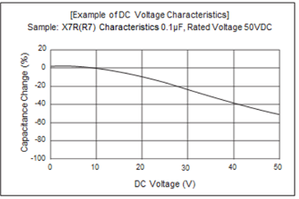
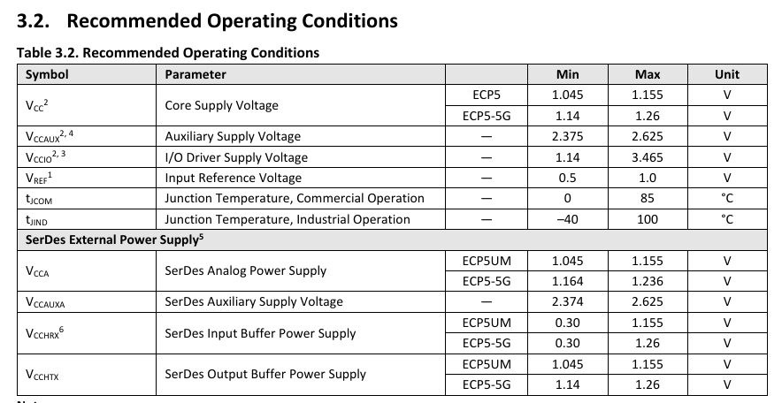
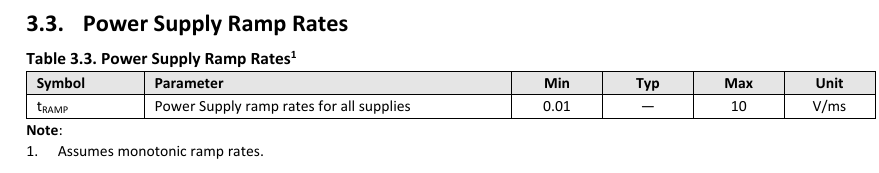
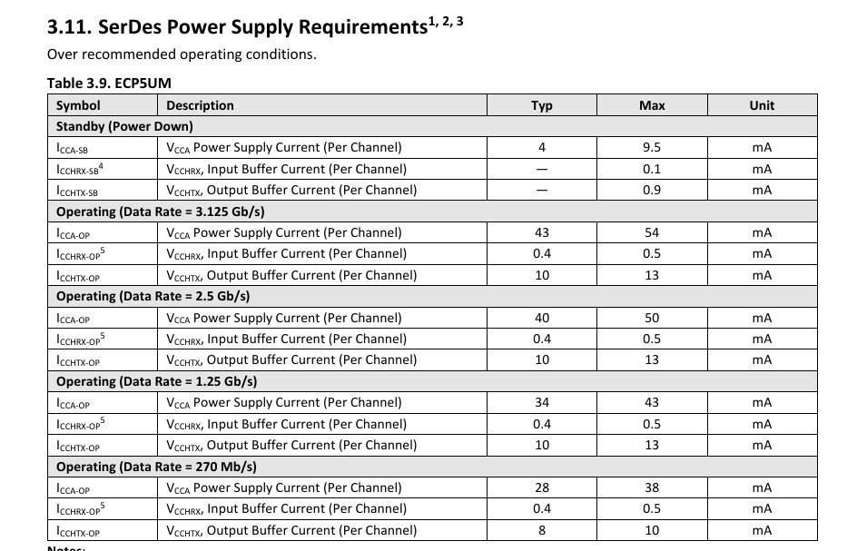

# ORBTrace m26

Evolution de l'ORBTrace mini avec mise à niveau des composants électronique (2026).

Objects:

- Mise à jour de la BOM
- JTAG SDIO à 50 MHz (performance équivalente à Keil Pro D) 
- Simulation hardware
- Compatible Orbuculum

DHVQFN-16-1EP_2.5x3.5mm_P0.5mm_EP1x2mm.step
## Personalized Component Field

- Package : pkg
- Tolerance
- I sat
- I rms / DC
- DCR
- SRF
- Voltage rating DC
- Dielectric
- Impedance
- Max. DC resistance
- Rated DC current
- XL / XR x over
- Temp coef
- Power

## Schematic page

### FPGA - LFE5U-25F-6BG256C (done)

Cette page est centrée autour du FPGA LFE5U de Lattice.  

Référence: LFE5U-25F-6BG256C  
Package : CABGA-256  
[Pinout](ressources/FPGA/FPGA-SC-02033-2-0-ECP5U-25-Pinout.csv)

Référence interne:  

- R_xxx : Résistance
- C_xxx : Capacité
- L_xxx : Inductance & Ferit Bead
- U_xxx : Généric
- F_xxx : Fusible
- J_xxx : connector
- Y_xxx : Clock / Quartz
- D_xxx : Diode & LED
- S_XXX : Switch

| Ref. interne | Ref. mouser          | ref fabricant      | fabricant          | Description                              | price €/1 | commentaire            |
| ------------ | -------------------- | ------------------ | ------------------ | ---------------------------------------- | --------: | ---------------------- |
| U_001        | 842-LFE5U25F6BG256C  | LFE5U-25F-6BG256C  | Lattice            | FPGA                                     |     17.03 | low availability       |
| U_002        | 511-M24128-BFMH6TG   | M24128-BFMH6TG     | STMicroelectronics | EERPOM 16Ko, I²C                         |      0.36 |                        |
| U_003        | 454-W956A8MBYA5I     | W956A8MBYA5I       | Winbond            | HyperRAM                                 |      5.70 | Fin de vie ! (1)       |
| U_004        | 727-S25FL064LABHV020 | S25FL064LABBHV020  | Infineon           | QSPI FLASH                               |      1.54 | (2)                    |
| Y_001        | 710-831025497        | 831025497          | Wurth Elektronik   | clock 30MHz                              |      1.20 | Changement de ref. (3) |
| J_001        | 649-68002-405HLF     | 68002-405HLF       | Amphenol FCI       | connector 01x05                          |     0.439 | non monté              |
| L_001        | 81-BLM11A601S        | BLM18AG601SN1D     | Murata Electronics | Ferrit bead                              |     0.086 | (4)                    |
| C_001        | 81-GRM188D71A106MA3D | GRM188D71A106MA73D | Murata Electronics | 10µF/ 10V / 0603 / X7T / 20%             |     0.198 |                        |
| C_002        | 81-GRM155C71C105KE11 | GRM155C71C105KE11J | Murata Electronics | 1µF / 16V / 0402 / X7S / 10%             |     0.138 |                        |
| C_003        | 81-GCM155R71C104KA5J | GCM155R71C104KA55J | Murata Electronics | 0.1µF / 16V / 0402 / X7R / 10%           |     0,086 |                        |
| R_001        | 603-RC0402FR-074K7L  | RC0402FR-074K7L    | YAGEO              | 4.7k / 1/16W / 1% / 100 ppm / 0402 / 50V |     0,086 |                        |
| R_002        | 603-RC0402FR-070RL   | RC0402FR-070RL     | YAGEO              | 0R / 1/16W / 1% / 100 ppm / 0402 / 50V   |     0,086 |                        |
|              |                      |                    |                    |                                          |           |                        |

S25FL 064 L AB B H V 02 0

24-ball BGA 6 x 8 mm package, 1.00 mm pitch

5x5 ball BGA footprint

Résistance, YAGEO : série **RC0402FR-07**

TODO: MAJ les ref de C et R de la page

(1): Des alternative existe, notamment chez ISSI, mais migration à analyser (notaient au niveau de l'alimentation et fréquence). Au vue de la quantité restant, on rest sur W956A8MBYA5I.
(2): Également disponible sous la ref S25FL064LABBHV023 (Packing type différend)
(3): Référence de base : NZ2520SB-30.000000M-NSA3415B, plus trouvable. Remplacement par du Wurth Elektronik (fabricant connut)

(4) Ferrit bead (recommander par Lattice, voir [lattice hardware checklist](ressources/FPGA/FPGA-TN-02038-2-1-ECP5-and-ECP5-5G-Hardware-Checklist.pdf)) pour clk:
D'àprès IA google, rev Murata Electronics utilisé par lattice dans la BOM de leurs carte d'évaluation. Correspond à `10. Clock Inputs`
- 0402 pour pouvoir la shunter avec une 0$\Omega$
- 120$\Omega$ à 100MHz
  

=> 1/5 : ok
=> 2/5 = 0.4 => -10%
=> 1/2 => -20%

## FPGA - LFE5U-25F-6BG256C 

 	CABGA-256 

https://www.latticesemi.com/en/Products/FPGAandCPLD/ECP5#_ECF70F301DC54BFFBD99DFBFCC8831D9

[FPGA Hardware checklist](ressources/FPGA/FPGA-TN-02038-2-1-ECP5-and-ECP5-5G-Hardware-Checklist.pdf)

Dans le projet orbtrace, il utilise un LFE5U-25F-6BG256C. Pouquoi on t-il mis une clock de 30MHz sur la pin PA35A

> The **ECP5** devices feature up to four embedded **3.2 Gb/s** SerDes channels, and the **ECP5-5G** devices feature up to four embedded **5 Gb/s** SerDes channels.  

| Device                   | LFE5UM-25F     |
| ------------------------ | -------------- |
| LUTs (k)                 | 24             |
| sysMEM Blocks (18 kb)    | 56             |
| Embedded memory (kb)     | 1 008 (~129ko) |
| Distribued RAM Bits (kb) | 194 (~24.8ko)  |
| 18 x 18 Multiplier       | 194            |
| SerDes (Dual/Channels)   | 1/2            |
| PLLs/DLLs                | 2/2            |

Attention a l'alim si utilisation 5G

3.10 Supply Current (Static) for LFE5U-12F/LFE5U-25F/LFE5UM-25F

(Frequency 0 Hz.S)

| Symbol      | Parameter                              | Typical (mA) |
| :---------- | :------------------------------------- | -----------: |
| $I_{CC}$    | Core Power Supply Current              |         77.0 |
| $I_{CCAUX}$ | Auxiliary Power Supply Current         |         16.0 |
| $I_{CCIO}$  | Bank Power Supply Current (Per Bank)   |          0.5 |
| $I_{CCA}$   | SerDes Power Supply Current (Per Dual) |         11.0 |

---

## JTAG (done)

Principale modifiaction:

Remplacement d'un level shifter 2 bits par un 4 bits.

Suppression du target power par la non disponibilité du composants SLG46582_DUAL_LDO.

Suppression de VTPWR

TLA2024 => modification pour mesurer VTref + ajout de 1.1, 2.5 et 3.3V pour remplacer SLG46811 (serial led)

74AVC4T774QWBQBRQ1 

Nouv ref

| Ref. interne | Ref. mouser          | ref fabricant               | fabricant          | Description                                | price €/1 | commentaire               |
| ------------ | -------------------- | --------------------------- | ------------------ | ------------------------------------------ | --------: | ------------------------- |
| J_002        | 649-68002-408HLF     | 68002-408HLF                | Amphenol FCI       | connector 01x08                            |      0.37 |                           |
| U_005        | 595-74AVC4T774QWBRQ1 | 74AVC4T774QWBQBRQ1          | Texas Instruments  | 4 bits Configurable Voltage-Level Shifting |      1.66 |                           |
| J_003        | 200-FTSH11001LDV7KP  | FTSH-110-01-L-DV-007-K-P-TR | Samtec             | JTAG 20 pin connector                      |      2.36 | ou FTSH-110-01-L-DV-007-K |
| J_004        | 200-FTSH10501LDV7KP  | FTSH-105-01-L-DV-007-K-P-TR | Samtec             | JTAG 10 pin connector                      |      1.83 | ou FTSH-105-01-L-DV-007-K |
| R_003        | 603-RC0402FR-07100RL | RC0402FR-07100RL            | YAGEO              | 100R / 1/16W / 1% / 100 ppm / 0402 / 50V   |     0.086 |                           |
| R_004        | 603-RC0402FR-07100KL | RC0402FR-07100KL            | YAGEO              | 100K / 1/16W / 1% / 100 ppm / 0402 / 50V   |     0.086 |                           |
| R_005        | 603-RC0402FR-071KL   | RC0402FR-071KL              | YAGEO              | 1K / 1/16W / 1% / 100 ppm / 0402 / 50V     |     0.086 |                           |
| U_006        | 595-TLA2024IRUGR     | TLA2024IRUGR                | Texas Instruments  | ADC                                        |      1.82 |                           |

SWD-TRACE-FTSH110

https://www.keil.com/support/man/docs/jlink/jlink_connectors.asp

---

## Connector externe (done)

Nouv ref

| Ref. interne | Ref. mouser          | ref fabricant       | fabricant          | Description                    | price €/1 | commentaire |
| ------------ | -------------------- | ------------------- | ------------------ | ------------------------------ | --------: | ----------- |
| J_005        | 798-DF40C70DP04V51   | DF40C-70DP-0.4V(51) | Hirose Connector   |                                |      1.23 | non cablé   |
| C_008        | 81-GRM155R71A474KE1D | GRM155R71A474KE01D  | Murata Electronics | 470nF / 10V / 0402 / X7R / 10% |     0,344 |             |

---

### Leds (done)

Nouv ref

| Ref. interne | Ref. mouser         | ref fabricant     | fabricant         | Description                               | price €/1 | commentaire |
| ------------ | ------------------- | ----------------- | ----------------- | ----------------------------------------- | --------: | ----------- |
| D_001        | 710-1315050930002   | 1315050930002     | Wurth Elektronik  | DEL multicolores WL-ICLED                 |     0.576 |             |
| U_007        | 595-74LVC1T45DBVRG4 | SN74LVC1T45DBVRG4 | Texas Instruments | 1 bits Configurable Voltage-Level Shiftin |     0.447 |             |
|              |                     |                   |                   |                                           |           |             |

## USB connector

Je suis dans l'optique de faire une refonte de la carte Orbtrace mini de manière à avoir des composants disponible / a jour. 
J'ai conserver le FPGA LFE5U-25F-6BG256C, le gestionnaire wifi USB3343-CP, mais j'ai remplacé les led par  du Wurth electronik 1315050930002, le controler de led par un level shifter SN74LVC1T45DBVRG4 et les level shifter 74AVC4T774QWBQBRQ1.
J'ai également supprimer la fonction d'apport de l'alimentation au micro (Power delivery) car le composants est introuvable sur Mouser. 
Au vue de cette fonctionnalité en moins, je me demande si je ne peut pas remplacer les DCDC (3.3, 2.5) par des LDO (plus stable mais consomme plus). 
Quite a faire : 5 -> 3.3V, 3.3-> 2.5V, 2.5->1.1
La ou actuellement on a 5->3.3, 5->1.1 et 3.3->2.5
Ou utiliser un autre DCDEC que le TLV62569DRL

Sur la carte orbtrace mini, éaquipé d'un LFE5U-25F-6BG256C, j'
Au niveau du JTAG, nous avons supprimer l'option qui permet de fournir l’alimentation.
Le FPGA est alimenté via 1.1V
Les Led via le 5V
Les logiques (FPGA) et autre : 3.3V. 

En sois 

| Ref. interne | Ref. mouser          | ref fabricant      | fabricant          | Description                               | price €/1 | commentaire |
| ------------ | -------------------- | ------------------ | ------------------ | ----------------------------------------- | --------: | ----------- |
| U_008        | 579-USB3343-CP       | USB3343-CP         | Microchip          | USB to ULPI                               |      1.49 |             |
| J_006        | 523-12401948E412A    | 12401948E412A      | Amphenol           | USB C                                     |      1.03 |             |
| D_002        | 511-USBLC6-2P6       | USBLC6-2P6         | STMicroelectronics | diode ESD                                 |      0.53 |             |
| F_001        | 652-MF-PSMF050X-2    | MF-PSMF050X-2      | Bourns             | PPTC 6V 500MA-HD 40A MAX / 0805           |     0.275 |             |
| U_009        | 595-TLV62568PDRLR    | TLV62568PDRLR      | Texas Instruments  | DC/DC 1A                                  |     0.224 |             |
| U_010        | 595-TLV71325PDQNR    | TLV71325PDQNR      | Texas Instruments  | LDO 2.5V / 150mA                          |     0.163 |             |
| R_006        | 603-RC0402FR-07453KL | RC0402FR-07453KL   | YAGEO              | 453k / 1/16W / 1% / 100 ppm / 0402 / 50V  |     0.086 |             |
| R_007        | 603-RC0402FR-07475KL | RC0402FR-07475KL   | YAGEO              | 475k / 1/16W / 1% / 100 ppm / 0402 / 50V  |     0.086 |             |
| R_008        | 603-RC0402FR-0782K5L | RC0402FR-0782K5L   | YAGEO              | 82.5k / 1/16W / 1% / 100 ppm / 0402 / 50V |     0.086 |             |
| R_009        | 603-RC0402FR-075K1L  | RC0402FR-075K1L    | YAGEO              | 5.1k / 1/16W / 1% / 100 ppm / 0402 / 50V  |     0.086 |             |
| R_010        | 603-RC0402FR-071ML   | RC0402FR-071ML     | YAGEO              | 1M / 1/16W / 1% / 100 ppm / 0402 / 50V    |     0.086 |             |
| R_011        | 603-RC0402FR-07180RL | RC0402FR-07180RL   | YAGEO              | 180Ω / 1/16W / 1% / 100 ppm / 0402 / 50V  |     0.086 |             |
| R_012        | 603-RC0402FR-0720KL  | RC0402FR-0720KL    | YAGEO              |  20k / 1/16W / 1% / 100 ppm / 0402 / 50V  |     0.086 |             |
| R_013        | 603-RC0402FR-078K06L | RC0402FR-078K06L   | YAGEO              | 8.06k / 1/16W / 1% / 100 ppm / 0402 / 50V |     0.086 |             |
| R_014        | 603-RC0402FR-0710KL  | RC0402FR-0710KL    | YAGEO              |  10k / 1/16W / 1% / 100 ppm / 0402 / 50V  |     0.086 |             |
| L_002        | 81-DFE32CAH2R2MR0L   | DFE32CAH2R2MR0L    | Murata Electronics | Inductance 2.2µH / 2.9A / 43 mΩ / 1210    |      0,86 |             |
| C_004        | 81-GRM21BZ70J226ME4L | GRM21BZ70J226ME44L | Murata Electronics | 22µF / 6.3V / 0805 / X7R / 20%            |     0.292 |             |
| C_005        | 81-GCM1555C1H6R8BA6J | GCM1555C1H6R8BA16J | Murata Electronics | 6.8pF / 50V / 0402 / C0G / 0.1pF          |     0.086 |             |
| C_006        | 81-GRM188Z71A475KE5J | GRM188Z71A475KE15J | Murata Electronics | 4.7µF / 10V / 0603 / X7R / 10%            |     0.198 |             |
| C_007        | 81-GRM21AR7LU472KW1D | GRM21AR7LU472KW01D | Murata Electronics | 4.7nF / 500V / 0805 / X7R / 10%           |     0.146 |             |
| D_003        | 710-150060GS75020    | 150060GS75020      | Wurth Elektronik   | Green LED / 3.2V / 20mA / 0603            |     0,318 |             |
| S_001        | 710-435151014824     | 435151014824       | Wurth Elektronik   | Switch push                               |     0,439 |             |

0402	1/16 W	100 ppm	1 %

TI workbench

453

RC0402FR-07453KL
RC0402FR-0784K5L

84.5
__R / __T => packaging

Connector_USB:USB_C_Receptacle_Amphenol_12401948E412A

USB3343 : Enhanced Single Supply Hi-Speed USB ULPI Transceiver

Status: in, production

Prix mouser: 1.49€ (USB3343-CP)

Pour compatilité : on reste sur le USB3343 USB2.0 transceiver via ULPI

Ref design : https://www.microchip.com/en-us/product/usb3343#Design%20Resources

https://www.ti.com/lit/eb/slyy228/slyy228.pdf?ts=1759892558029

En regroupant AN26.21 de microchip, divers sources + gimini (IA google) => 1 MOhm || 4.7 nF

https://www.pcbway.com/blog/PCB_Design_Tutorial/How_to_add_USB_C_to_your_projects.html

Sur un USBc, comment relier le shield et le GND ?

Connecteur : 523-12401948E412A  
Marque amphenol
prix: 1.03
Choix: dans la base kicad + réputation de la marque amphenol

## Résistance

| Ref. mouser       | ref fabricant | fabricant | Valeur $\Omega$ | Package | price €/1 | commentaire                                             |
| ----------------- | ------------- | --------- | --------------- | ------- | --------- | ------------------------------------------------------- |
| 755-KTR18EZPJ105  | KTR18EZPJ105  | ROHM      | 1 M             | 1206    | 0.138     | résistance pour reprise shield, 1206 pour disponibilité |
| 667-ERJ-2RKF5101X | ERJ-2RKF5101X | Panasonic | 5.1 k           | 0402    | 0.086     | résistance USB                                          |

## Capacitor

| Ref. mouser          | ref fabricant     | fabricant | Valeur | Package | price €/1 | commentaire                                           |
| -------------------- | ----------------- | --------- | ------ | ------- | --------- | ----------------------------------------------------- |
| 603-AC805KRX7RYBB472 | AC0805KRX7RYBB472 | YAGEO     | 4.7 nF | 0805    | 0.129     | Capacité pour reprise shield, 0805 pour disponibilité |

## JTAG

Remplacement du SN74AVC2T245 par SN74AVC4T774-Q1 (ref: 74AVC4T774QWBQBRQ1)

2 level shifter vers 4 avec 500Mbps de bande passange

Je suis en train de revoir l'hardware orbtrace mini. 

J'ai plusieurs problème sur l'orbtrace min:

1. Le SLG46582 qui, de ce que j'en comprend, permet d'alimenter la cible n'est pas approvisionne.  
   Sur la plupart des carte que j'ai eu à flasher, l'alimentation était fourni. La sonde ne la fournissait jamais. De plus, sur des cartes industrielle, on peut vite monté à du 3.3V / 250mA voir 500mA. Donc, pour cette revision, si je peu, je préfère le supprimer.  
   Par contre, la detection de l'alimentation est nécessaire.  
2. Pour des question de coûts, je pensait ne pas monté le connecteur externe
3. Je voudrais monté en SDWO à 50 MHz (comme ulink pro D). Je me demandais si la clock de 50 MHz suffisait.

_______________

Pour un design à base de FPGA Lattice ECP5 (qui fonctionne à des fréquences et des vitesses de commutation élevées), le choix des composants passifs doit privilégier la stabilité en fréquence, une faible résistance/inductance parasite (ESR/ESL) et des coefficients thermiques robustes.
Voici les références et spécifications industrielles standard que je te conseille chez les fabricants majeurs (Murata, Yageo, Samsung, Panasonic), hautement disponibles et économiques.
------------------------------
## 1. Les Condensateurs de Découplage (MLCC)
Pour les FPGA, il faut impérativement bannir les diélectriques bas de gamme (comme le Y5V ou le Z5U) dont la capacité s'effondre avec la température ou la tension continue appliquée (DC Bias). Utilise uniquement du X5R (jusqu'à 85°C) ou idéalement du X7R (jusqu'à 125°C). [1, 2] 

* 10 µF / 0603 (1608 métrique) : Tu peux tout à fait sourcer toutes tes capacités chez Murata (série GRM) et toutes tes résistances chez Yageo (série RC). Ce sont les deux leaders incontestés sur ces composants de commodité.
* Spécification requise : Diélectrique X5R ou X7R, tension ≥ 6.3V (idéalement 10V pour limiter l'effet de DC Bias sur tes rails 3.3V/2.5V), tolérance ±10% ou ±20%.
   * Référence conseillée : Murata GRM188R61A106KE69D (X5R, 10V) ou Samsung CL10A106KP8NNNC (X5R, 10V). Si tu veux du X7R absolu (plus cher), vise le Murata GRM188R70J106ME47D (X7R, 6.3V). [3] 
* 1 µF / 0402 (1005 métrique) :
* Spécification requise : Diélectrique X5R ou X7R, tension ≥ 10V ou 16V, tolérance ±10%.
   * Référence conseillée : Murata GRM155R71A105KE15D (X7R, 10V) ou Yageo CC0402KRX7R6BB105 (X7R, 10V).
* 0.1 µF / 0402 (1005 métrique) :
* Spécification requise : Diélectrique X7R, tension ≥ 16V ou 25V (très standard et offre une excellente stabilité), tolérance ±10%.
   * Référence conseillée : Murata GRM155R71C104KA88D (X7R, 16V) ou Yageo CC0402KRX7R7BB104 (X7R, 16V).

------------------------------
## 2. Les Résistances (Pull-Up, Pull-Down, Straps)
Pour les résistances numériques en boîtier 0402, la technologie couche épaisse (Thick Film) standard est parfaite. Une précision de ±1% est aujourd'hui devenue le standard industriel (souvent moins chère ou au même prix que le ±5%).

* 4.7k Ω / 0402 (Pull-up / Pull-down) :
* Spécification requise : Puissance 1/16W (0.063W), tension max ≥ 50V, coefficient de température standard (±100 ou ±200 ppm/°C).
   * Référence conseillée : Yageo RC0402FR-074K7L ou Panasonic ERJ-2RKF4701X.
* 0 Ω / 0402 (Straps de configuration ou options de routage) :
* Spécification requise : "Jumper" ou "0R", courant max ≥ 1A, résistance interne maximale la plus faible possible (souvent < 50 mΩ).
   * Référence conseillée : Yageo RC0402JR-070RL ou Panasonic ERJ-2GE0R00X.

------------------------------
## 💡 Conseils pour ton routage et ta nomenclature (BOM) :

   1. Uniformisation des marques : Tu peux tout à fait sourcer toutes tes capacités chez Murata (série GRM) et toutes tes résistances chez Yageo (série RC). Ce sont les deux leaders incontestés sur ces composants de commodité.
   2. Attention au placement des 0.1 µF : Ce sont les condensateurs les plus critiques pour le bruit haute fréquence du FPGA. Place-les au plus près des broches d'alimentation du FPGA, idéalement directement sous le composant (via-in-pad ou vias adjacents) si tu es sur un PCB 4 couches ou plus. [4] 
   3. DC Bias Check : Rappelle-toi qu'un condensateur MLCC de 10 µF sous une tension de 3.3V ne mesure en réalité plus que ~5 à 6 µF à cause du phénomène de baisse de capacité sous tension continue. C'est pour cela qu'un modèle spécifié à 10V au lieu de 6.3V est fortement recommandé pour tes rails 2.5V et 3.3V.

As-tu déjà défini le nombre de couches de ton PCB (4 ou 6 couches) pour l'intégration de ces composants 0402 sous le boîtier du FPGA ? [5] 

[1] [https://www.reddit.com](https://www.reddit.com/r/ECE/comments/89290a/x7r_x5r_c0g_a_concise_guide_to_ceramic_capacitor/?tl=fr)
[2] [https://www.reddit.com](https://www.reddit.com/r/ElectricalEngineering/comments/1ldd9ul/am_i_understanding_this_correct_a_10uf_0402_x5r/?tl=fr)
[3] [https://viox.com](https://viox.com/fr/mccb-instantaneous-trip-settings-10in-vs-12in/)
[4] [https://www.wonderfulpcb.com](https://www.wonderfulpcb.com/fr/blog/ic-power-supply-pins-functions-identification-guide/)
[5] [https://jlcpcb.com](https://jlcpcb.com/fr/pcb-fabrication/fr4-pcb)

----

Dans KiCad, le circuit imprimé (PCB) est divisé en plusieurs couches superposées. Chaque couche a un rôle précis, de la gravure du cuivre à l'impression des textes. [1] 
Voici la description des principales couches de KiCad, classées par fonction.
## 🔴 Les couches de cuivre (Conducteurs)
Ces couches contiennent les pistes électriques, les pastilles (pads) et les plans de masse ou d'alimentation. [2, 3, 4, 5] 

* F.Cu (Front Copper) : Couche de cuivre supérieure (top). Utilisée pour les composants de surface (SMT) et les pistes de signal.
* B.Cu (Back Copper) : Couche de cuivre inférieure (bottom). Utilisée pour les pistes de signal et les plans de masse.
* InX.Cu (In1.Cu, In2.Cu, etc.) : Couches de cuivre internes. Présentes uniquement sur les circuits multicouches (4, 6, 8 couches ou plus) pour l'alimentation ou les signaux denses. [6, 7, 8, 9, 10] 

## 🟢 Les couches de masque de soudure (Protection)
Le masque de soudure (souvent vert) protège le cuivre de l'oxydation et empêche les ponts d'étain lors du soudage. [11, 12] 

* F.Mask (Front Mask) : Masque de soudure supérieur. KiCad crée automatiquement des ouvertures dans cette couche autour des pastilles à souder.
* B.Mask (Back Mask) : Masque de soudure inférieur.

## ⚪ Les couches de sérigraphie (Visuels et marquages)
Ces couches contiennent les dessins des composants, les textes (R1, C1), les logos et les indications visuelles nécessaires à l'assemblage. [13] 

* F.Silkscreen (Front Silkscreen) : Sérigraphie supérieure.
* B.Silkscreen (Back Silkscreen) : Sérigraphie inférieure.

## 🩶 Les couches de pâte à braser (Fabrication industrielle)
Ces couches définissent les zones où la pâte à braser (crème d'étain) doit être déposée via un pochoir (stencil) avant le passage au four.

* F.Paste (Front Paste) : Emplacement de la pâte pour les composants CMS du dessus.
* B.Paste (Back Paste) : Emplacement de la pâte pour les composants CMS du dessous. [14] 

## 📐 Les couches de mécanique et de contour
Ces couches servent à la découpe du circuit et à l'organisation de la conception. [15] 

* Edge.Cuts : Limites physiques du PCB. C'est ici que vous dessinez le contour extérieur de la carte et les découpes internes (trous oblongs, encoches).
* F.Courtyard / B.Courtyard : Zone d'encombrement physique d'un composant. Elle empêche de placer deux composants trop près l'un de l'autre lors du placement. [16] 
* F.Fab / B.Fab : Couches de fabrication. Elles contiennent les contours simplifiés des composants et leurs valeurs pour documenter l'assemblage, sans surcharger la sérigraphie finale.

## 📝 Les couches utilisateur (Génériques)

* User.Drawings / User.Comments / User.EcoX : Couches optionnelles pour ajouter des notes de fabrication, des lignes de repère, des dimensions ou des instructions spécifiques pour l'usine.

## PCB

Attention: Pas d'équipotentielle pour composant 'U16' pad '2' (pas de pin 2 en symbole).  x

Attention: Pas d'équipotentielle pour composant 'U3' pad '5' (pas de pin 5 en symbole).   x
Attention: Pas d'équipotentielle pour composant 'U8' pad 'A5' (pas de pin A5 en symbole). x
Attention: Pas d'équipotentielle pour composant 'U8' pad 'A2' (pas de pin A2 en symbole). x
Attention: Pas d'équipotentielle pour composant 'U8' pad 'C2' (pas de pin C2 en symbole). x

Attention: Pas d'équipotentielle pour composant 'U9' pad 'B1' (pas de pin B1 en symbole).
Attention: Pas d'équipotentielle pour composant 'U9' pad 'C3' (pas de pin C3 en symbole).
Attention: Pas d'équipotentielle pour composant 'U9' pad 'A3' (pas de pin A3 en symbole).
Attention: Pas d'équipotentielle pour composant 'U9' pad 'A5' (pas de pin A5 en symbole).
Attention: Pas d'équipotentielle pour composant 'U9' pad 'A2' (pas de pin A2 en symbole).
Attention: Pas d'équipotentielle pour composant 'U9' pad 'E4' (pas de pin E4 en symbole).
Attention: Pas d'équipotentielle pour composant 'U9' pad 'E3' (pas de pin E3 en symbole).
Attention: Pas d'équipotentielle pour composant 'U9' pad 'E2' (pas de pin E2 en symbole).
Attention: Pas d'équipotentielle pour composant 'U9' pad 'E1' (pas de pin E1 en symbole).
Attention: Pas d'équipotentielle pour composant 'U9' pad 'B5' (pas de pin B5 en symbole).
Attention: Pas d'équipotentielle pour composant 'U9' pad 'C1' (pas de pin C1 en symbole).
Attention: Pas d'équipotentielle pour composant 'U9' pad 'D1' (pas de pin D1 en symbole).
Attention: Pas d'équipotentielle pour composant 'U9' pad 'D5' (pas de pin D5 en symbole).
Attention: Pas d'équipotentielle pour composant 'U9' pad 'C5' (pas de pin C5 en symbole).
Attention: Pas d'équipotentielle pour composant 'U9' pad 'E5' (pas de pin E5 en symbole).

Erreur: U3 pad PAD non trouvé en orbtrace:Texas_X2SON-4_1x1mm_P0.65mm.